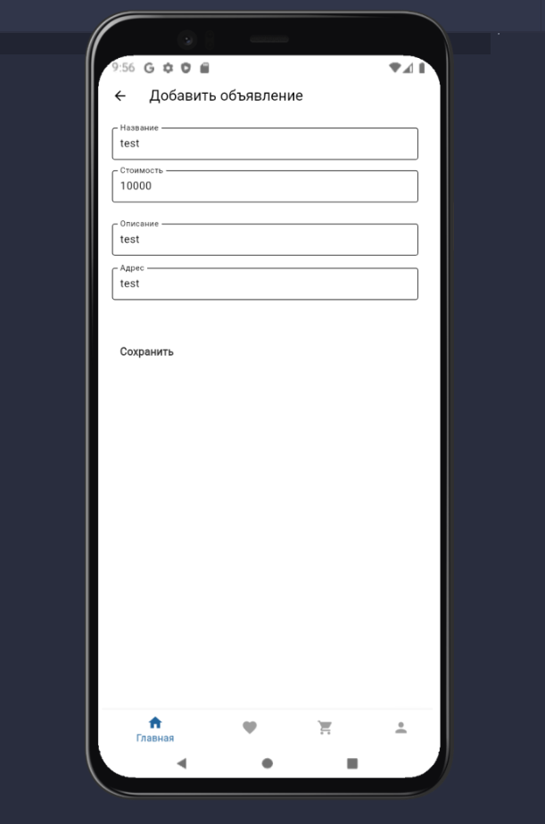

# Практическая работа №8
Выполнил Святкин С. ЭФБО-01-22
 
Мобильное приложение для моего сайта [MusicTrade.ru](https://github.com/sv022/MusicTrade/tree/main)
 
Реализована связь приложения с тестовым сервером на python. Загрузка объявлений через GET запрос. Во время ожидания ответа сервера отображается значок загрузки.
 

 
Загруженные объявления
 

 
Реализована функция удаления объявления. При нажатии на сервер отправляется DELETE запрос.
 

 
Реализована функция добавления объявления. При добавлении на сервер отправляется POST запрос, содержащий в себе информацию о новом объявлении.
 

 
Добавленное объявление отображается вместе с остальными объявлениями.
 

 

Список запросов:
 
`GET http://10.192.229.176:9876/listing/$id - Получить товар id`
 
`GET http://10.192.229.176:9876/listings - Получить все товары`
 
`POST http://10.192.229.176:9876/listing- добавить товар`
 
`DELETE http://10.192.229.176:9876/listing/$id - Удалить товар id`