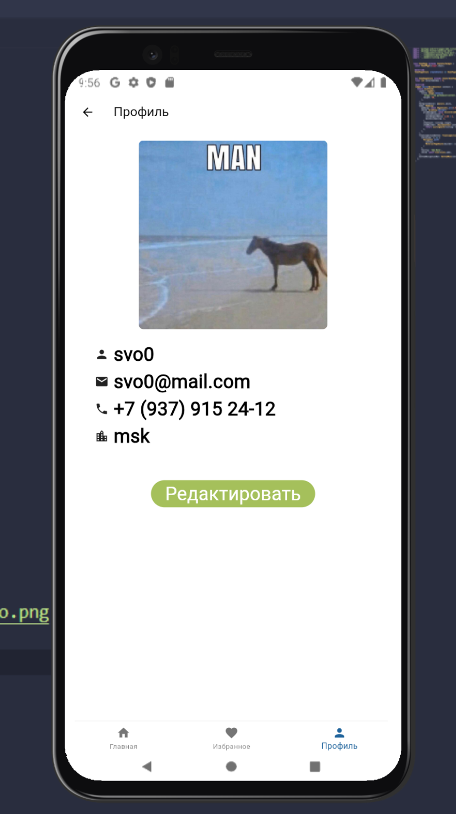
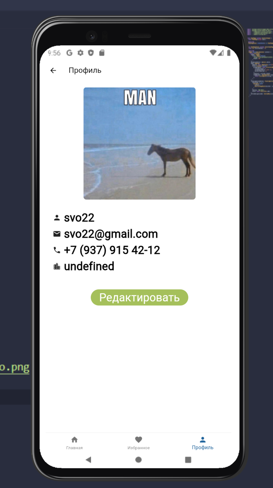

# Практическая работа №5
Выполнил Святкин С. ЭФБО-01-22
 
Мобильное приложение для моего сайта [MusicTrade.ru](https://github.com/sv022/MusicTrade/tree/main)
 
Экран выбора опции входа или регистрации
 

 
Нажимаем кнопку "Вход", попадаем на экран с информацией о пользователе
 

 
Нажимаем кнопку "Редактировать"
 

 
Изменяем данные в желаемых полях, нажимаем кнопку "Сохранить"
 

 
Данные профиля обновились
 

 